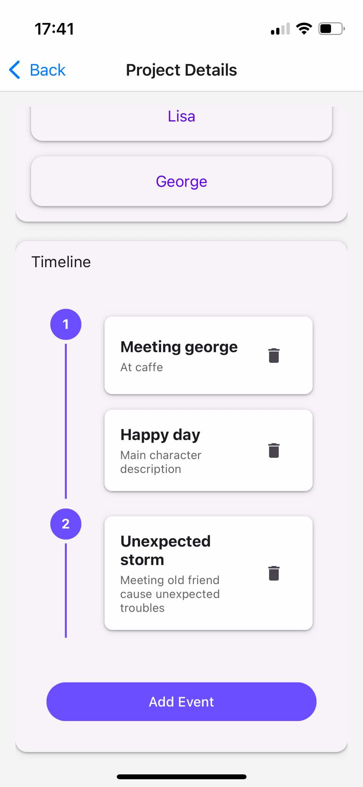

# Books Writer Manager

A React Native mobile app designed to help writers organize their stories, characters, and track their writing progress. Perfect for authors who want to keep their creative work organized and accessible on their mobile devices.

## Features

- **Project Management**

  - Create and manage multiple writing projects
  - Add project descriptions and notes
  - Track current writing position

- **Character Management**

  - Create detailed character profiles
  - Add character descriptions and background information
  - Keep track of character relationships and roles

- **Timeline Organization**

  - Build interactive story timelines
  - Add chapter markers and key events
  - Track chapter completion status
  - Visualize story progression

- **Data Persistence**
  - All data stored locally on device
  - Automatic saving of changes
  - No internet connection required

## Screenshots

|                                     See current project                                      |                                    Edit project                                    |                                      Edit character                                       |
| :------------------------------------------------------------------------------------------: | :--------------------------------------------------------------------------------: | :---------------------------------------------------------------------------------------: |
|  |  |  |

|                                  Add new event                                   |                                         Use drag&drop to reorder events                                         |                                                    Monitor progress by checking written chapters                                                    |
| :------------------------------------------------------------------------------: | :-------------------------------------------------------------------------------------------------------------: | :-------------------------------------------------------------------------------------------------------------------------------------------------: |
|  |  |  |

|                                    Manage multiple projects                                     |
| :---------------------------------------------------------------------------------------------: |
|  |

## Tech Stack

- **Framework**: React Native with Expo
- **Language**: TypeScript
- **UI Components**: React Native Paper
- **Navigation**: Expo Router
- **Storage**: AsyncStorage for local data persistence

## Getting Started

1. Clone the repository
2. Install dependencies

cd books-writer-manager
npm install

3. Run the app
   npm start

or if you have Android you can run build version of app:
https://expo.dev/artifacts/eas/qNTbwiZrv4GcAMAm2N1X9w.apk

## Contributing

Feel free to submit issues and enhancement requests!
